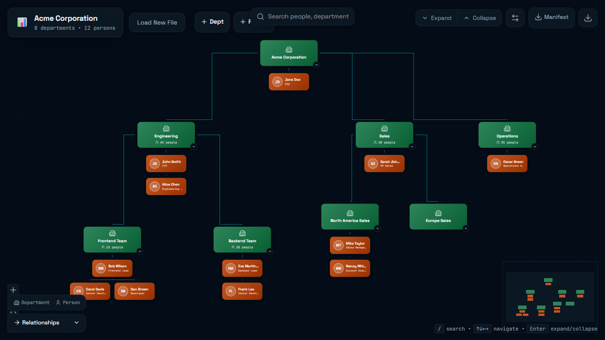

# Org Chart

Interactive organization chart viewer for YAML/JSON manifests.

It can run as a local web app (`vite`) and as a zero-setup CLI via:

`npx github:emileSWAAA/org-chart`

## Quick Start

```bash
npm install
npm run dev
```

Open the URL printed by Vite (typically `http://localhost:5173`).

## Why

Most org charts are static and lose important context.

This project lets you model an organization as code, then explore it as a graph with both hierarchy and cross-team relationships.

- Keep org structure in version control.
- Model both formal reporting lines and informal dependencies.
- Add arbitrary metadata (key-value dictionary) to any entity.

## Screenshot

Sample manifest rendered in the app (same structure as "Load sample organization"):



## Features

- Parse YAML or JSON manifests.
- Display departments, people, and vendors in a single graph.
- Show direct relationships you define in `relationships` (for example `depends_on`, `influences`, `collaborates_with`).
- Generate indirect/implicit relationships from hierarchy fields:
  - `department_hierarchy` from department `parentId`
  - `person_management` from person `managerId`
- Store custom metadata as a key-value dictionary per entity and relationship.
- Inspect, filter, search, and export the graph.
- Validate manifests (entity references, relationship types, circular department hierarchy checks).

## Setup

Prerequisites:

- Node.js 20.19+ (or 22.12+)
- npm

Install dependencies:

```bash
npm install
```

## Run

### Web App (Dev)

```bash
npm run dev
```

Then open the local URL printed by Vite (typically `http://localhost:5173`).

### CLI (Recommended for quick use)

Run with a manifest file:

```bash
npx github:emileSWAAA/org-chart --file ./sample-manifest.yaml
```

Run with inline YAML:

```bash
npx github:emileSWAAA/org-chart --yaml "name: My Team
entities:
  - id: team
    type: department
    name: My Team"
```

Run without input (opens upload UI):

```bash
npx github:emileSWAAA/org-chart
```

Note: when using `--file` or `--yaml`, the CLI writes a temporary `public/_autoload.yaml` file while the app is running and removes it on exit.

CLI options:

```text
org-chart [options]

Options:
  -f, --file <path>    Path to a YAML/JSON manifest file
  -y, --yaml <string>  Inline YAML manifest content
  -h, --help           Show help
```

## Build

```bash
npm run build
```

## Quality Checks

Run these before pushing:

```bash
npm run lint
npm run build
```

## YAML Structure

Top-level shape:

```yaml
name: Example Corp

entities:
  - id: engineering
    type: department
    name: Engineering

  - id: cto
    type: person
    name: John Smith
    parentId: engineering
    metadata:
      title: CTO
      email: john@example.com

relationships:
  - from: cto
    to: engineering
    type: manages
    note: Technical leadership
    strength: high
```

Entity fields:

- `id` (required): unique ID.
- `type` (required): `person`, `department`, `vendor`.
- `name` (required): display name.
- `parentId` (optional): parent department for departments, owning department for people.
- `managerId` (optional, people only): manager person ID.
- `metadata` (optional): free-form key-value dictionary.

Relationship fields:

- `from`, `to`, `type` are required.
- `note`, `strength`, `metadata` are optional.
- Supported explicit types include: `manages`, `reports_to`, `influences`, `depends_on`, `collaborates_with`.

Reference files:

- Schema: `.github/skills/org-chart-viewer/references/SCHEMA.md`
- Examples: `.github/skills/org-chart-viewer/references/EXAMPLES.md`
- Template: `.github/skills/org-chart-viewer/assets/manifest-template.yaml`
- Full sample used for screenshot: `sample-manifest.yaml`

## Agent Skill (Org Chart Viewer)

This repository includes a reusable Copilot skill:

- Skill file: `.github/skills/org-chart-viewer/SKILL.md`
- Skill name: `org-chart-viewer`

What it does:

- Helps generate an org YAML manifest from user/team info.
- Uses the included template + schema/examples.
- Launches the viewer with `npx github:emileSWAAA/org-chart --file ./org-chart.yaml`.

How to use it:

1. Ask Copilot to create or update an org chart manifest.
2. Mention that it should use the `org-chart-viewer` skill.
3. Provide people/departments/reporting lines.
4. Run the generated manifest with the CLI command above.

Example prompt:

```text
Use the org-chart-viewer skill to create an org chart for a 3-department startup with CEO, CTO, VP Sales, and one external vendor.
```

## Open Source Notes

- Contribution guide: `CONTRIBUTING.md`
- Security policy: `SECURITY.md`
- Code of conduct: `CODE_OF_CONDUCT.md`

## License

MIT. See `LICENSE`.
